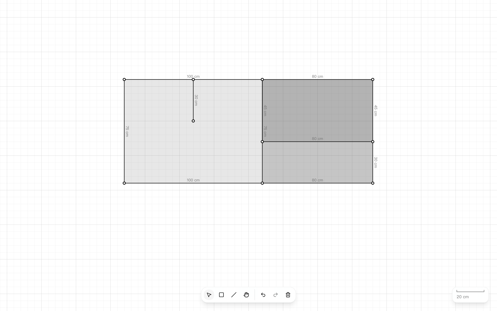

# Blueprint

> Sketch a floor plan the way you would on graph paper: drag out rooms, draw walls, and let the corners snap.

[](https://github.com/zyx1121/blueprint/actions) &nbsp;[](https://blueprint-zyx-tw.vercel.app) &nbsp;[](#license)

Every layout tool is either a full CAD suite or a whiteboard that does not know what a centimetre is. Blueprint is the small thing in between: an infinite SVG canvas, a real scale bar, and shapes that snap to each other so four walls become a room.


<sub>Two rooms drawn as rectangles, a third closed from three lines, and a partition wall snapped to the shared corner.</sub>

**[Try it live](https://blueprint-zyx-tw.vercel.app)**

## Features

- **Draw rectangles and lines** in centimetres on an infinite canvas with a live scale bar.
- **Snap corners, edges, and grid** while dragging, with alignment guides.
- **Close faces automatically**: lines that form a loop become a polygon, a line across a face splits it, and deleting a shared wall merges the two.
- **Edit by number**: select a vertex, wall, or room and type exact sizes in 0.1 cm steps.

## Tech stack

| Layer           | Choice                   |
| --------------- | ------------------------ |
| Framework       | Next.js 16 (App Router)  |
| Styling         | Tailwind CSS + shadcn/ui |
| Canvas          | Plain SVG, no dependency |
| Package manager | Bun                      |

## Getting started

```bash
git clone https://github.com/zyx1121/blueprint && cd blueprint
bun install
bun dev
```

### Shortcuts

| Key         | Action           |
| ----------- | ---------------- |
| `V`         | Select and move  |
| `R`         | Rectangle        |
| `L`         | Line             |
| `H`, Space  | Pan              |
| Wheel       | Pan              |
| Ctrl+Wheel  | Zoom             |
| `⌫`         | Delete selection |
| `⌘Z`, `⇧⌘Z` | Undo, redo       |

## Deploy

Push to `main` and Vercel does the rest.

## Contributing

Issues and PRs welcome: start with [CONTRIBUTING.md](https://github.com/zyx1121/.github/blob/main/CONTRIBUTING.md).

## License

[MIT](LICENSE) · Measure twice, drag once.
